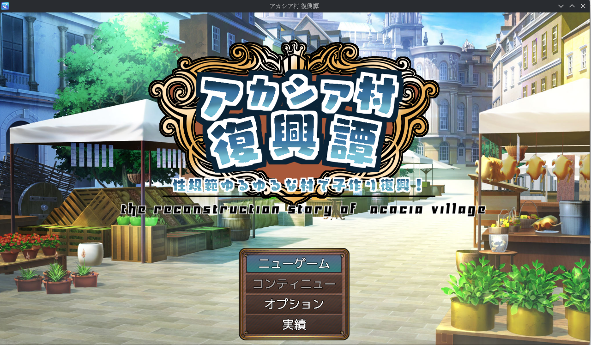
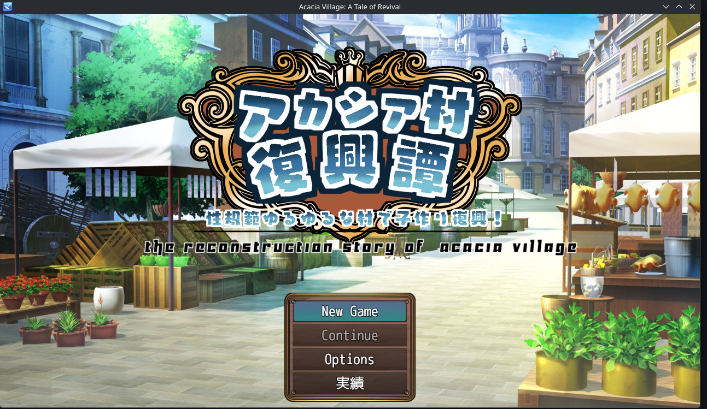
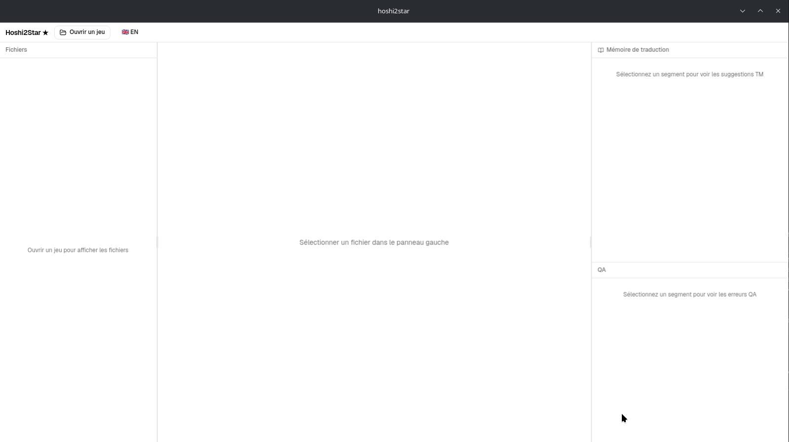
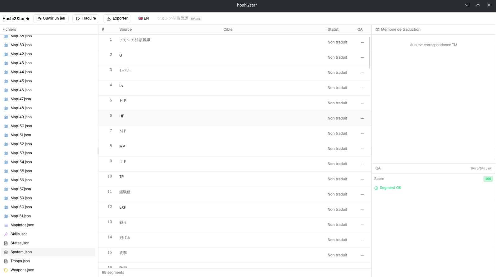
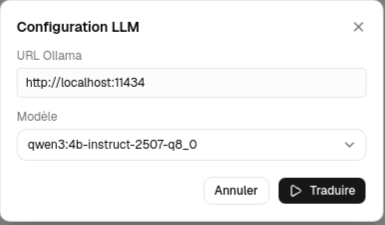
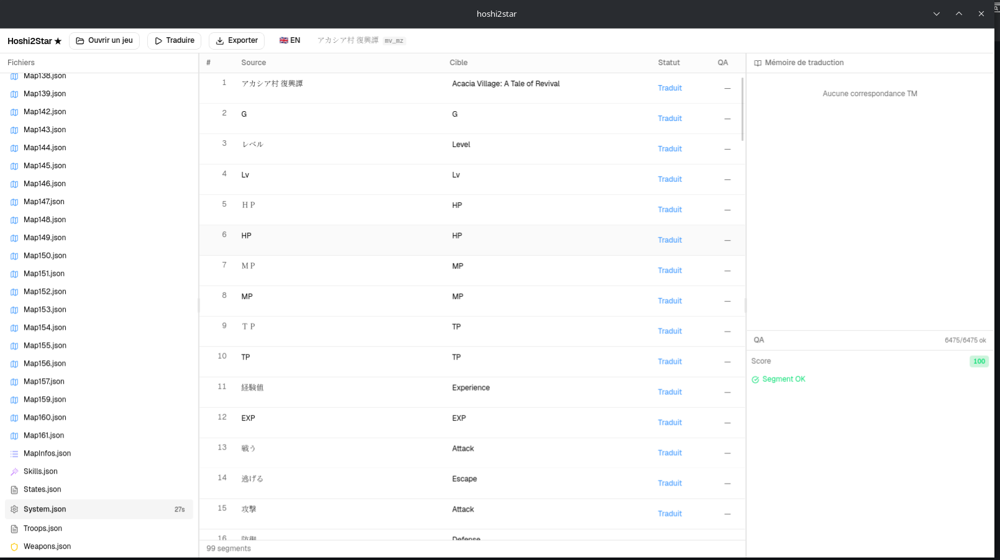

> 🇬🇧 [Read in English](README.md)

# Hoshi2Star ★


**星 → ★ — Éditeur CAT + orchestrateur LLM pour la traduction fan de jeux RPG japonais**

## Screenshots

### Avant & Après
| Original (日本語) | Traduit (English) |
|:-:|:-:|
|  |  |

### Hoshi2Star en action

**1. Ouvrir l'application**


**2. Charger un jeu — segments extraits**


**3. Configurer Ollama et traduire**


**4. Segments traduits en 27s — score QA 100**


---

## Fonctionnalités

- Ouvrir et extraire des jeux RPG Maker MV/MZ
- Traduction assistée par LLM (Ollama local, aucune clé API requise)
- Translation Memory (TM) cross-projets avec recherche exacte
- QA automatique : placeholders, longueur de ligne, BOM UTF-8
- Export des traductions dans les fichiers du jeu
- Interface CAT 3 panneaux : Fichiers | Grille | TM + QA
- Liste de projets — projets récents avec cartes de progression, continuer ou supprimer en un clic
- Bouton traduire par segment — retraduire un segment sans passer par le batch
- Extraction auto du glossaire — le LLM détecte les termes clés automatiquement à l'ouverture
- TM fuzzy matching — seuil de similarité 80% avec distance de Levenshtein
- Export rapport QA en HTML autonome

---

## Moteurs supportés

| Moteur | Statut | Formats |
|---|---|---|
| RPG Maker MV | ✅ Supporté | .json, .rpgmvp |
| RPG Maker MZ | ✅ Supporté | .json, .rpgmvp |
| RPG Maker VX Ace | 🔜 F3 | .rvdata2 |
| Wolf RPG | ⚠️ Partiel | .dat |
| RPG Developer Bakin | 🔜 F5 | .rbpack |

---

## Prérequis

- **Ollama** installé : https://ollama.ai
- Modèle recommandé : `ollama pull qwen3:4b-instruct-2507-q8_0`

> La variante `-instruct` répond directement sans phase de
> raisonnement, ce qui produit des traductions plus rapides
> et plus fiables.
- **Linux** : webkit2gtk-4.1 (généralement déjà installé)
- **Windows** : aucun prérequis supplémentaire

---

## LLM cloud avec RunPod (optionnel)

Vous pouvez louer un GPU cloud sur [RunPod](https://runpod.io) au lieu d'utiliser Ollama en local.

→ **[Guide complet RunPod](docs/runpod.fr.md)**

---

## Installation

**Linux :**
```bash
chmod +x hoshi2star_*.AppImage
./hoshi2star_*.AppImage
```

**Windows :** télécharger et exécuter le `.msi` depuis GitHub Releases.

---

## Démarrage rapide

1. Démarrer Ollama : `ollama serve`
2. Ouvrir Hoshi2Star
3. Cliquer sur **"Ouvrir un jeu"** → sélectionner le dossier du jeu
4. Sélectionner un fichier dans le panneau gauche
5. Cliquer sur **"Traduire"** → configurer Ollama (URL + modèle)
6. Lancer la traduction
7. Réviser et modifier les segments dans la grille
8. Cliquer sur **"Exporter"** pour appliquer les traductions au jeu

---

## Développement

**Prérequis :** Rust stable (rustup), Node.js LTS + pnpm

**Linux en plus :** webkit2gtk-4.1, base-devel

```bash
git clone https://github.com/KATBlackCoder/Hoshi2Star
cd Hoshi2Star
pnpm install
pnpm tauri dev
```

**Tests :**
```bash
cargo test --manifest-path src-tauri/Cargo.toml
pnpm typecheck
```

---

## Stack technique

| Couche | Technologie |
|---|---|
| Runtime desktop | Tauri v2 |
| Backend | Rust, sqlx, tokio |
| Frontend | React 19, TypeScript |
| UI | shadcn/ui, TanStack Table v8 |
| État global | Zustand |
| Base de données | SQLite (embarquée) |
| LLM | Ollama (local) |

---

## Feuille de route

Voir [ROADMAP.md](ROADMAP.md) pour le plan de développement complet.

---

## Licence

MIT — voir [LICENSE](LICENSE)
