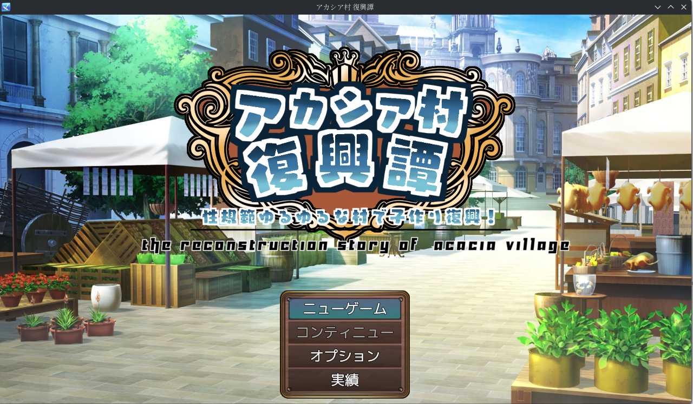
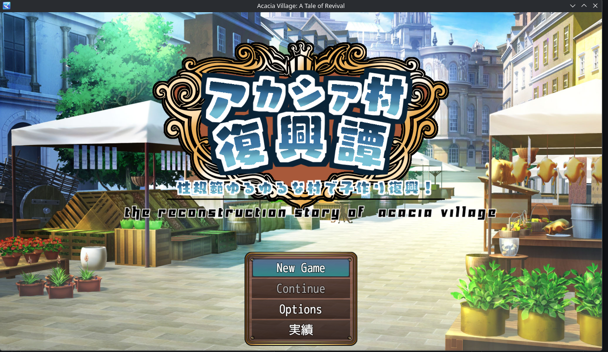
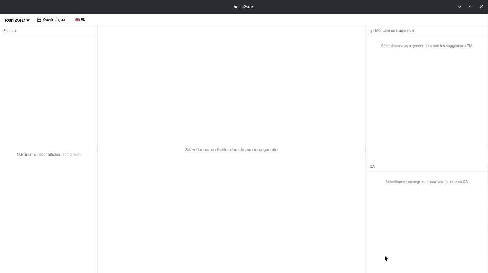
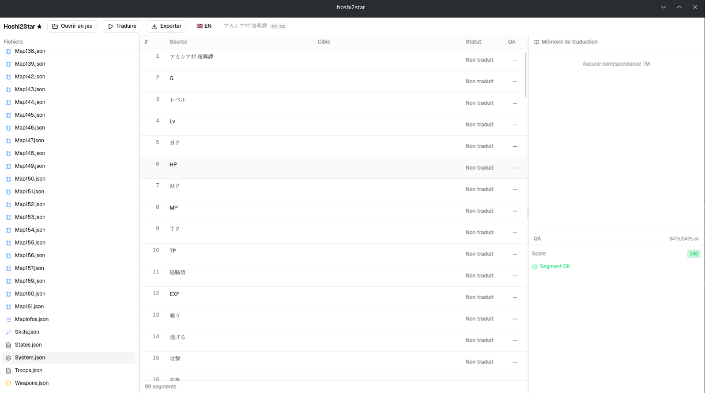
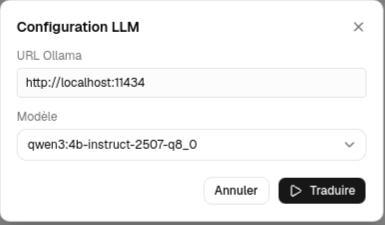
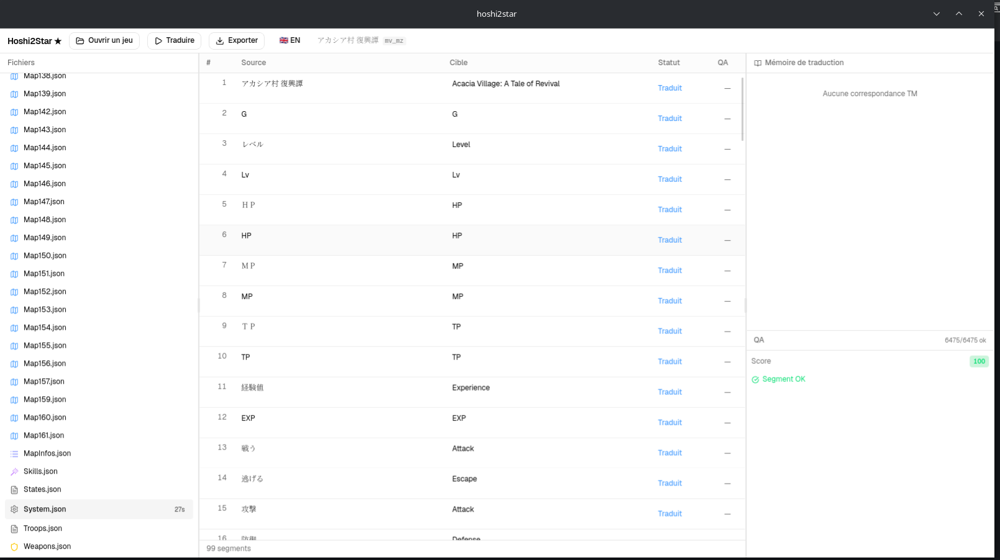

<div align="center">


# Hoshi2Star&nbsp;★

**星 → ★**

CAT editor + LLM orchestrator for fan-translating Japanese **RPG Maker** & **Wolf RPG** games

[](CHANGELOG.md)
[](LICENSE)
[](https://github.com/KATBlackCoder/Hoshi2Star/releases)
[](https://tauri.app)
[](https://www.rust-lang.org)

🇬🇧 English&nbsp;·&nbsp;[🇫🇷 Français](README.fr.md)

</div>

---

<div align="center">

| Original&nbsp;(日本語) | Translated&nbsp;(English) |
|:-:|:-:|
|  |  |

</div>

> **Hoshi2Star** extracts the text from a Japanese RPG, translates it with a local (or cloud) LLM under a proper CAT workflow — translation memory, glossary, QA — then writes the translations back into the game.

**Jump to:** [Features](#-features) · [Engines](#-supported-engines) · [Install](#-installation) · [Quick start](#-quick-start) · [Development](#-development)

---

## ✨ Features

**Translate**
- 🤖 LLM-assisted translation via **local Ollama** — no API key, runs offline
- ☁️ Optional **cloud GPU** via RunPod (HTTPS endpoint)
- 🎯 Batch, per-segment, or whole-project **"Translate All"** with automatic work/rest cooldown
- ♻️ Adaptive retry + batch-split on failure, placeholder-safe (`\V[n]`, `\C[n]`, Wolf codes)

**Quality**
- 🧪 Automatic **QA**: missing placeholders, line width (pixel-based), UTF-8 BOM, glossary mismatch
- 📄 Export a standalone **QA report** as self-contained HTML
- 📖 **Glossary** — two levels (global + project), auto-extracted by the LLM on project open
- 🧠 **Translation Memory** (cross-project): exact + fuzzy match (80% Levenshtein), TMX export

**Workflow**
- 🗂 3-panel CAT interface: **Files · Grid · TM + QA**
- 📇 Project list with progress cards — continue or delete in one click
- 📦 Export translations back into the game files (ZIP-packaged)

---

## 🎮 Supported Engines

| Engine | Status | Formats |
|---|---|---|
| RPG Maker MV / MZ | ✅ Supported | `.json`, `.rpgmvp` / `.rpgmvo` |
| Wolf RPG v1 / v2 / v3 | ⚠️ Partial | `.dat`, `.mps`, `.wolf` |
| RPG Maker VX Ace | ⏸ Code ready, disabled | `.rvdata2` |
| RPG Developer Bakin | 🔜 Planned (F5) | `.rbpack` |

> [!NOTE]
> Wolf RPG **v3.5+ / WolfX (Pro, encrypted)** archives must be decrypted with UberWolf first, then open the plain `Data/` folder.

---

## 🖼 Screenshots

<details>
<summary><b>Hoshi2Star in action</b> — click to expand</summary>

<br />

**1. Open the app**



**2. Load a game — segments extracted**



**3. Configure Ollama and translate**



**4. Segments translated in 27s — QA score 100**



</details>

---

## 📦 Installation

Download the latest build from [**GitHub Releases**](https://github.com/KATBlackCoder/Hoshi2Star/releases).

**Linux** (AppImage):
```bash
chmod +x hoshi2star_*.AppImage
./hoshi2star_*.AppImage
```
`.deb` and `.rpm` packages are also provided.

**Windows:** download and run the `.msi` (or `-setup.exe`).

### Prerequisites

- **[Ollama](https://ollama.ai)** installed locally
- Recommended model:
  ```bash
  ollama pull qwen3:4b-instruct-2507-q8_0
  ```
- **Linux:** `webkit2gtk-4.1` (usually already installed) · **Windows:** none

> [!TIP]
> The `-instruct` variant answers directly, without a "thinking" phase — faster and more reliable translations.

---

## 🚀 Quick Start

1. Start Ollama: `ollama serve`
2. Open Hoshi2Star and click **"Open Game"** → select the game folder
3. Pick a file in the left panel
4. Click **"Translate"** → configure Ollama (URL + model)
5. Review and edit segments in the grid
6. Click **"Export"** to write the translations back into the game

> [!NOTE]
> Prefer a cloud GPU? You can point Hoshi2Star at a [RunPod](https://runpod.io) HTTPS endpoint instead of local Ollama — see the **[RunPod setup guide](docs/runpod.md)**.

---

## 🛠 Development

**Prerequisites:** Rust stable (rustup), Node.js LTS + pnpm · **Linux extra:** `webkit2gtk-4.1`, `base-devel`

```bash
git clone https://github.com/KATBlackCoder/Hoshi2Star
cd Hoshi2Star
pnpm install
pnpm tauri dev
```

**Checks:**
```bash
pnpm typecheck && pnpm test
cargo clippy --manifest-path src-tauri/Cargo.toml -- -D warnings
cargo test --manifest-path src-tauri/Cargo.toml
```

---

## 🧱 Tech Stack

| Layer | Technology |
|---|---|
| Desktop runtime | Tauri v2 |
| Backend | Rust · sqlx · tokio |
| Frontend | React 19 · TypeScript |
| UI | shadcn/ui · TanStack Table v8 |
| State | Zustand |
| Database | SQLite (embedded) |
| LLM | Ollama (local) · RunPod (cloud) |
| Tests | Vitest · `cargo test` |

---

## 🗺 Roadmap

See [ROADMAP.md](ROADMAP.md) for the full development plan and the [CHANGELOG](CHANGELOG.md) for release history.

---

## 📄 License

MIT — see [LICENSE](LICENSE).
